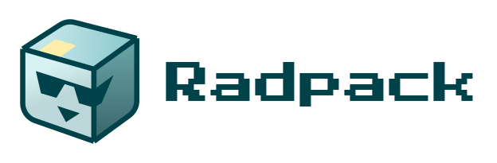

# @radpack/rollup-plugin
A [rollup] plugin for building libraries with radpack.

[Documentation](https://godaddy.github.io/radpack)



## Installation
```sh
npm install --save-dev @radpack/rollup-plugin
```


## Usage
```js
import radpack from '@radpack/rollup-plugin';

export default {
  input: 'src/index.js',
  output: {
    dir: 'dist'
  },
  plugins: [
    radpack()
  ]
};
```

For more examples, check out the [library examples](examples).


## Node
By default, this plugin is meant to build libraries for both client and server environments. If you have node specific code in your library, you will need to bypass rollup's default behavior for importing these modules. Example in [issue #22].


[examples]: ../../examples/libs/
[rollup]: https://rollupjs.org/
[issue #22]: https://github.com/godaddy/radpack/issues/22

